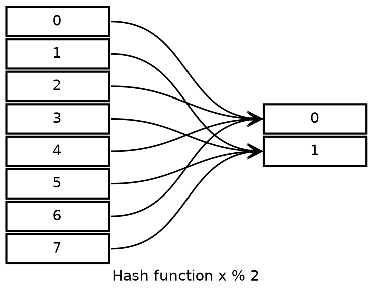

# Hash Table

Hash table is a data structure using a small amount of space to store the values which in a large space. The access time is constant.

## Hash Function

## Hash Confliction

## Progressive Migration

## Consistant Hashing
