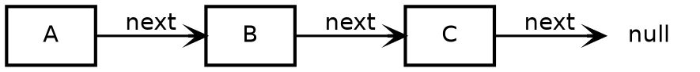
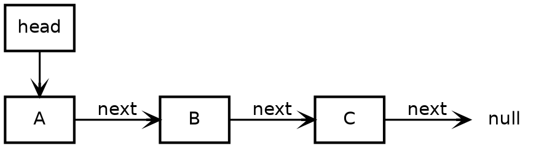
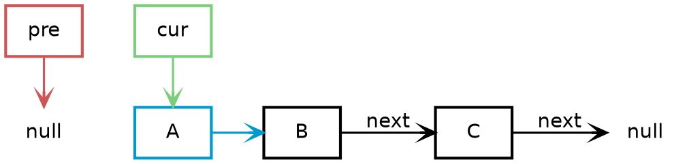
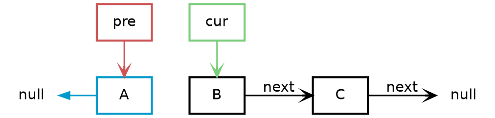
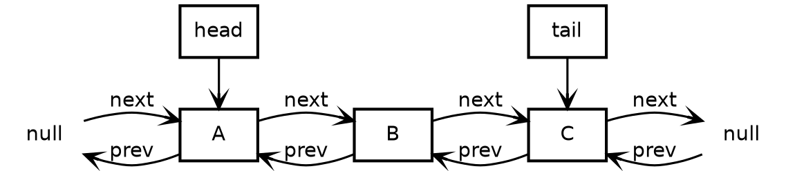
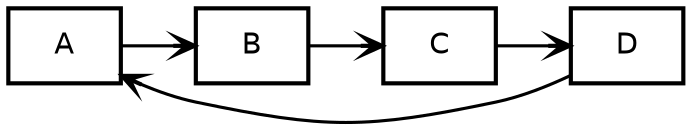

# Linked List

Linked List is a list of uncontigous memory blocks.

## Singly Linked List

Singly linked list has a pointer *next* pointing to the successor of the current node in the linked list.



### Traversion

We can traverse through the linked list using a pointer.



### Reversion

We can use three pointer to reverse the order of the linked list.

```go
cur, pre := head, nil
for cur.Next != nil {
	cur, cur.Next, pre = cur.Next, pre, cur
}

```

Before



After



### Nth node from the end

To find the Nth node from the tail of the linked list, we can use two pointers.
First move the faster pointer N steps and then move both pointers until the faster pointer reach the end of the linked list.
This can save us one time of full traversion.


```go
slow, fast := head, head
for i := 0; i < N; i++ {
	fast = fast.Next
}
for fast.Next != nil {
	fast = fast.Next
	slow = slow.Next
}
```

## Doubly Linked List

Doubly linked list has another pointer *prev* pointing to the predecessor of the current node as well.



## Circular Linked List

The head and tail of a circular linked list are linked together.

